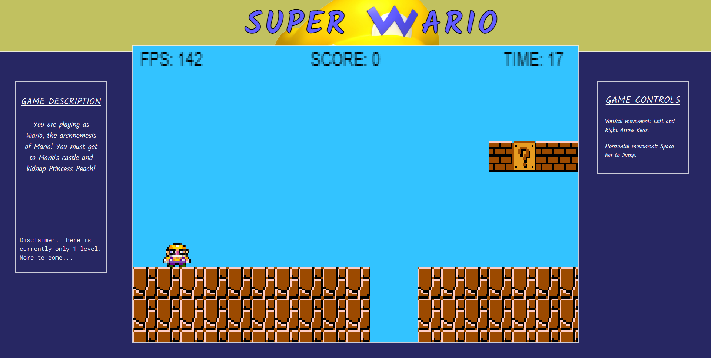

Deployed at https://jkjoeeekim.github.io/Super_Wario/dist/index

# Background:
- You will play as Wario, the archnemesis of Mario! You must break into Mario's castle and steal Princess Peach. You will face enemies and obstacles along the way. Get to the end and steal Princess Peach!

# Features:
## In Super Wario, players will be able to:
  - Use Left and Right arrow keys for vertical movement.
  - Use Spacebar for jumping action.
  - Navigate Wario through an obstacle course to get to the castle on the other side.
  - Defeat of evade enemy Goombas along the way.

## In addition, this project will include:
  - In-game timer and score tracker, accumulated through picking up coins and killing Goombas.
  - Instructions page to show instructions before game starts.

# Wireframe:

# Technologies, Libraries, APIs:
## This project will be implemented with the following technologies:
  - the `Canvas API` to render the game board.
  - `Webpack` to bundle and transpile the source JavaScript code.

# Implementation timeline:
  ## Friday July 9th, 2021
    - Import sprites and render them.
    - Set up basic tiles for floors and roofs.
    - Create Wario sprite and allow for user input to render movement.

  ## Monday July 12th, 2021
    - Create and update readme.md.
    - Make character side-to-side scrolling and jumping more fluid.

  ## Tuesday July 13th, 2021
    - Fix camera-follow when side scrolling.
    - Add green pipes and item blocks.
    - Fix bug with side scrolling and gravity effect.