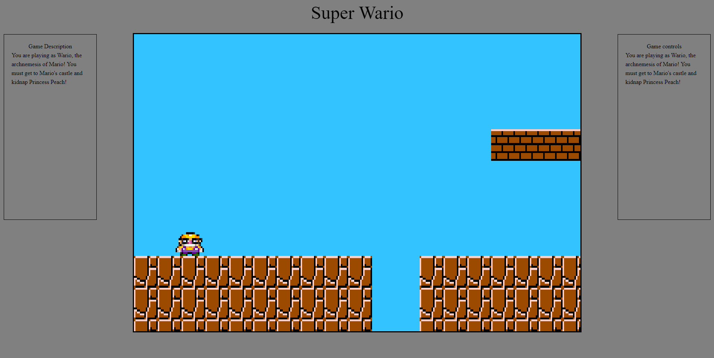
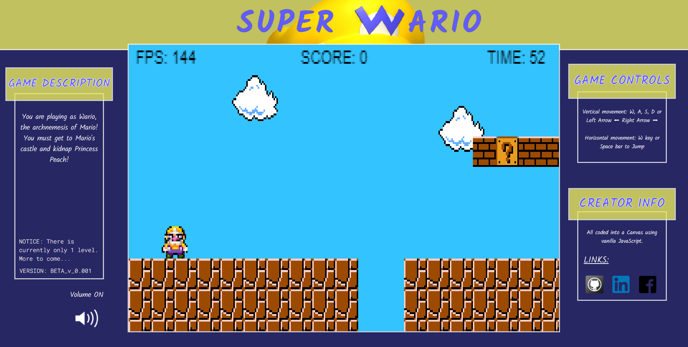

Deployed at https://jkjoeeekim.github.io/Super_Wario/dist/index

# Background:
- You will play as Wario, the archnemesis of Mario! You must break into Mario's castle and steal Princess Peach. You will face enemies and obstacles along the way. Get to the end and steal Princess Peach!

# Features:
## In Super Wario, players will be able to:
  - Use Left and Right arrow keys or W, A, S, D for vertical movement.
  - Use Spacebar for jumping action.
  - Navigate Wario through an obstacle course to get to the castle on the other side.
  - Defeat of evade enemy Goombas along the way.

## In addition, this project also includes:
  - In-game timer and score tracker, accumulated through picking up coins and killing Goombas.
  - Able to click a link and send an email at the end of the game.

# Wireframe:
## Before:

## Current Version:

# Technologies, Libraries, APIs:
## This project will be implemented with the following technologies:
  - the `Canvas API` to render the game board.
  - `Webpack` to bundle and transpile the source JavaScript code.
  - `Google Fonts API` for fonts: `Kalam` and `Roboto Mono`

# Implementation timeline:
  ## Friday July 9th, 2021
    - Import sprites and render them.
    - Set up basic tiles for floors and roofs.
    - Create Wario sprite and allow for user input to render movement.

  ## Monday July 12th, 2021
    - Create and update readme.md.
    - Make character side-to-side scrolling and jumping more fluid.

  ## Tuesday July 13th, 2021
    - Fix camera-follow when side scrolling.
    - Add green pipes and item blocks.
    - Add blinking effect for item blocks.
    - Fix bug with side scrolling and gravity effect.
    - Fix bug with character going off screen.

  ## Wednesday July 14th, 2021
    - Add (6) enemy Goombas.
    - Add walking effect for Goombas.
    - Add bounds to prevent character from going backwards off screen.
    - Add triggered movement for goombas.
    - Add death effect for goombas when stepped on.
    - Add death effect for wario when touched by a goomba.
    - Add gravity effect for all goombas.
    - Add flag pole at the end of the map.
    - Add initial endgame sequence when reaching the flagpole.
    - Add points and time counter to the top bar.
    - Add links to home page.
    - Style home page and alerts.
    - Add google fonts API.
    - Remove keymaster.js API.

  ## Thursday July 15th, 2021
    - Add clouds in the background.
    - Add item box triggered animations.
    - Add wario walking and death animations.
    - Add W, A, S, D movement and update game controls.
    - Add audio cues to game.
    - Add game introduction.
    - Add volume mute/unmute controls.
    - Add quick email share functionality.
    - Update homepage style.
    - Adjust volume levels.